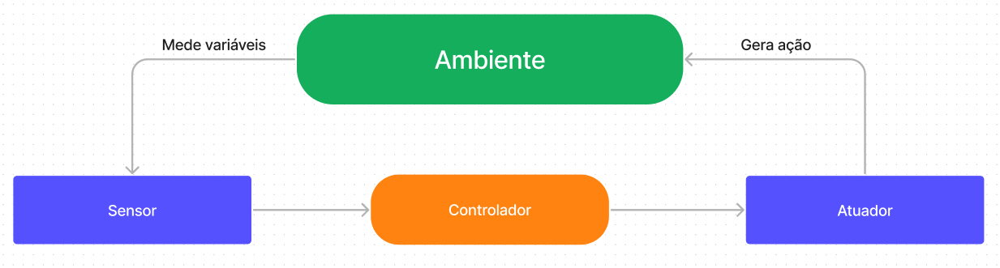
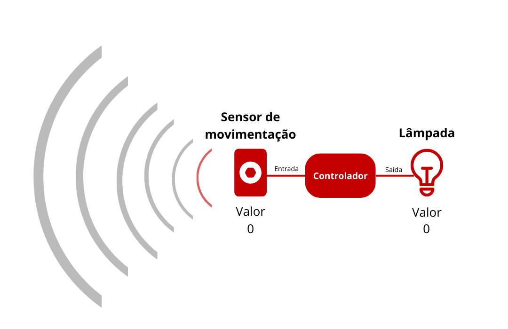

<p align="center">
  <br/>
 Introdução a microcontroladores com ESP32 <br/>
  <i>Owlficinas - Aula 2</i>
</p>


<br/>

# :pushpin:  Sensores e atuadores

Os sensores e atuadores são componentes eletrônicos e a forma do nosso sistema interagir com o ambiente e suas variáveis. 

<p  align="center">

</p>


Os **sensores** são componentes que medem variáveis do ambiente  e convertem essa informação em sinais elétricos, utilizando um transdutor interno, para usar como entrada no controlador. 

**Exemplos de sensores:**
| **Nome do sensor** | **O que é medido** |
|:------------------:|:------------------:|
|   LDR 3mm 3547-2   |    Iluminosidade   |
|        LM35        |     Temperatura    |
|       TTP223B      |        Touch       |
|      TCRT5000      |    Infravermelho   |


Já os **atuadores** manipulam as variáveis do ambiente, agindo como uma saída pro controlador. Ou seja, eles transformam os sinais elétricos em outros tipos de energia para criar alguma ação no ambiente.

**Exemplos de atuadores**
| **Nome do atuador** |          **O que é feito**         |
|:-------------------:|:----------------------------------:|
|     Servo motor     |            Movimentação            |
|       LED RGB       | Emissão de luz de diferentes cores |
|         LED         |           Emissão de luz           |
|     Display OLED    | Emissão de luz em pixels numa tela |
|        Buzzer       |           Emissão de som           |


**Exemplo de sistema**

- Um sensor de movimento **mede** se há um movimento no ambiente
- Caso haja, um LED acende, **manipulando** (ou mudando) a iluminação do ambiente   

<p  align="center">

</p>

Os sinais de entrada e saída podem ser definidos como **digitais** ou **analógicos**.

<br/>

# :pager: Sinal digital 

O sinal **digital** pode assumir apenas dois valores no seu sinal, que podem ser interpretados como zero ou um.
****Exemplo:*** um sensor de luminosidade que devolve um 1 caso esteja claro e 0 caso não esteja*

***Implementação geral:***

```python
import machine

# Criando um pin de saída no pino #0
saida = machine.Pin(0, machine.Pin.OUT)

# Mudando o valor
saida.value(0) # Você também pode usar p0.on()
saida.value(1) # Você também pode usar p0.off()

# Criando um pin de entrada no pino #2
entrada = machine.Pin(2, machine.Pin.IN)

# Ler e printar o valor do pino de entrada
print(entrada.value())
```

<br/>

# :watch: Sinal analógico

O sinal **analógico** pode assumir qualquer valor no seu sinal dentro de uma faixa de operação. 
****Exemplo:*** um sensor de luminosidade que devolve um valor para a luminosidade do local*

Há algumas ***implementações gerais*** sinais analógicos no ESP32 com Micropython:

## ADC (Analog to Digital Converter)

Para ter valores analógicos no ESP32 como **entrada**, nós precisamos utilizar o ADC para converter esse sinais analógicos em digitais a fim de que sejam interpretados pelo controlador. 

Pode ser usado nos pinos 0, 2, 4, 12, 13, 14, 15, 25, 26, 27, 32, 33, 34, 35, 36, 39

```python
import machine

# Criando um pin de entrada ADC no pino #12
entrada = machine.ADC(machine.Pin(12))

# Ler e printar o valor analógico do pino de entrada
print(entrada.read())
```

## DAC (Digital to Analog Converter)

Caso você queira ter valores analógicos como saída, é necessário utilizar o DAC. Ele converte os sinais digitais da placa em sinais analógicos na saída. 

Só pode ser usado nas portas 25 e 26.

```python
import machine

# Criando um pin de saída DAC no pino #25
saida = machine.DAC(machine.Pin(25))

# Mudar o valor de sinal do pino (entre 0 e 255)
saida.write(150)
```

## PWM (Pulse Width Modulation)

Outra forma é utilizar o PWM, que é uma forma de criar uma saída análoga artificial em um pino digital. Para fazer isso, o sinal do pino é mudado de 0 para 1 rapidamente, por isso, utiliza dois parâmetros: frequência e ciclo de trabalho. 

Pode ser usado em qualquer saída analógica.

```python
import machine

# Criando um pin de entrada PWM no pino #0
# O primeiro parâmetro é o Pin, o segundo é a frequência e o terceiro é o ciclo de trabalho
saida = machine.PWM(machine.Pin(0), freq=5000, duty_u16=32768)

# Ler e printar o valor analógico do pino de entrada
print(entrada.read())
```

<p  align="center">

</p>

:warning: **Atenção!** Alguns sensores podem precisar de outros pinos específicos ou uma programação específica. As implementações aqui são exemplos gerais :)

<br/>

# :round_pushpin: Em qual pino conectar no ESP 32?

- Pinos nos quais é possível usar ADC: 0, 2, 4, 12, 13, 14, 15, 25, 26, 27, 32, 33, 34, 35, 36, 39
- Pinos nos quais é possível usar DAC: 25 e 26
- Pinos nos quais é possível usar PWN: Qualquer saída digital

*P.S.: 34, 35, 36 e 39 apenas recebem entrada*

VCC e GND vocês conheceram na aula 1 :)

<p  align="center">

</p>


:warning: **Atenção!** Alguns pinos podem apresentar comportamento inesperado. 

Os pinos verdes são seguros para uso. Os amarelos podem apresentar comportamento imprevisível e é recomendado evitar os vermelhos

<p  align="center">

</p>

Para saber mais sobre, [veja aqui](https://lastminuteengineers.com/esp32-pinout-reference/) :)

<br/>

# :star_struck: Como usar novos sensores e atuadores?

## 1. Como escolher e comprar um sensor/atuador específico?

Em sites de compra de componentes eletrônicos, procure pela ação que você precisa que o componente tenha (por exemplo, sensor de iluminação ou LED azul). Existem vários componentes que podem fazer a mesma coisa, então leia sua descrição para ver qual se aplica melhor ao seu projeto. 

Caso você tenha um sensor/atuador e não saiba qual é, em alguns casos, pode ter um nome escrito no componente.

Alguns componentes podem ter uma versão **original**, que é apenas o sensor, ou versão com **módulo**, no qual há um pequeno circuito para facilitar ações como definir valores para funcionamento e conexão no seu circuito.

Sugestões de sites de confiança:

- [Baú da eletrônica](https://www.baudaeletronica.com.br/)
- [Curto Circuito](https://curtocircuito.com.br/)

## 2. Como saber as informações desse sensor/atuador? (O que ele faz, como montar o circuito, especificações...)

Todo componente eletrônico, como sensores e atuadores, possuem um documento chamado **datasheet**. 

O datasheet reune dados do componentes, tais como:

- Nome e descrição da funcionalidade do componente
- Circuitos padrões ou exemplos de aplicações
- Valores máximos e mínimos de trabalho
- Outras informações técnicas que podem ser úteis sobre o uso do componente  

Geralmente, baste procurar o nome do componente + datasheet em um buscador ou no site do fabricante! Caso as informações estejam técnicas demais, aproveite para **visitar outros sites e ver exemplos de circuitos** e aplicações utilizando este componente :)

Também é interessante olhar no **site de onde você comprou o componente**, já que, normalmente, deixam uma breve descrição (que é um resumo do datasheet!)

## 3. Como programar esse sensor/atuador com MicroPython na ESP 32?

Agora que você sabe qual componente tem em mão, como programá-lo? Usando a documentação!

Caso tenha dúvidas sobre funções, módulos, protocolos e drivers do ESP32 com MicroPython, veja a [documentação do MicroPython para ESP32](https://docs.micropython.org/en/latest/esp32/quickref.html)  

Caso não resolva seu problema, procure por guias onlines utilizando o mesmo sensor, vendo seu funcionamento e se é necessário módulos e protocolos diferentes também. [RandomNerdTutorials](https://randomnerdtutorials.com/projects-esp32-esp8266-micropython/) possuem guias de passo-a-passo de vários componentes no ESP32 com Micropython, mas fique à vontade para explorar outros :)

<br/>

# :woman_technologist: Mão na massa

Explore os subdiretórios deste repositório para ver exemplos simples de circuitos e códigos para diferentes sensores e atuadores:

**Sensores**

- [LDR (Luminosidade)](./LDR)
- Umidade do solo
- Touch
- LM 35 (Temperatura)

**Atuadores**

- Servomotor
- LED RGB
- [LED](./LED)
- Buzzer
- Display OLED

<br/>

# :busts_in_silhouette: Contribuições

Caso você use algum sensor/atuador que não está aqui, fique à vontade para enviar um [Pull Request](https://docs.github.com/pt/pull-requests/collaborating-with-pull-requests/proposing-changes-to-your-work-with-pull-requests/creating-a-pull-request) no repositório para complementá-lo!

