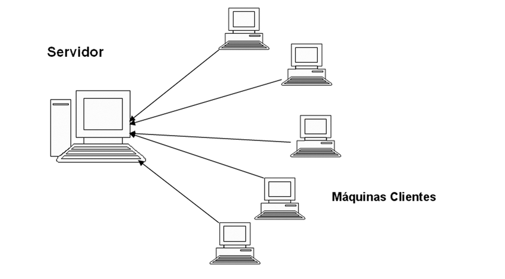
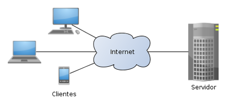

   
 Introdução a microcontroladores com ESP32  
  <i>Owlficinas - Aula 3</i>

 

# :pushpin:  Conexões e Servidores

Conexões e servidores pemitem acessos remotos, com isso podemos controlar a execução de procedimentos armazenados de servidores.

<h1>💻Servidores</h1>

Os **servidores** são provedores de recursos responsáveis por:
- Rodar códigos
- Prove serviços e respostas ao cliente 
- Armazena dados e interfaces que podem ser acessadas

**Tipos de servidores:**
Servidor de arquivos: É um servidor dedicado para armazenar e compartilhar arquivos em uma rede. É comumente usado em empresas para centralizar o armazenamento de documentos, imagens, vídeos e outros tipos de arquivos, permitindo o acesso e compartilhamento entre os usuários.

 - **Servidor web**: É responsável por hospedar sites e aplicativos web. Ele recebe as solicitações dos clientes (navegadores) e fornece as páginas web correspondentes. Aplicações populares que utilizam servidores web são sites de comércio eletrônico, redes sociais, blogs e serviços de streaming de mídia.

 - **Servidor de banco de dados**: É um servidor que gerencia o armazenamento e a recuperação de dados em um sistema de gerenciamento de banco de dados (SGBD). É amplamente utilizado em aplicações empresariais, como sistemas de gerenciamento de recursos humanos, sistemas de reservas e sistemas de CRM (Customer Relationship Management).

 - **Servidor de e-mail**: É responsável pelo envio, recebimento e armazenamento de e-mails. Os servidores de e-mail permitem que os usuários enviem e recebam mensagens eletrônicas através de protocolos como SMTP (Simple Mail Transfer Protocol) e IMAP (Internet Message Access Protocol). Exemplos populares de aplicativos de e-mail que usam servidores de e-mail são o Gmail, o Outlook e o Thunderbird.

 - **Servidor de aplicativos**: É utilizado para hospedar e executar aplicativos empresariais e web. Esses servidores fornecem o ambiente necessário para a execução de aplicativos de negócios, como sistemas de gestão empresarial (ERP), sistemas de gerenciamento de relacionamento com o cliente (CRM) e sistemas de comércio eletrônico.

 - **Servidor de jogos**: É dedicado a hospedar jogos online, permitindo que vários jogadores se conectem e interajam em um ambiente virtual compartilhado. Esses servidores suportam a comunicação em tempo real entre os jogadores e gerenciam aspectos como autenticação, persistência do estado do jogo e coordenação de eventos.

 - **Servidor de streaming de mídia**: É usado para fornecer conteúdo de áudio e vídeo em tempo real pela internet. Serviços de streaming como Netflix, Spotify e YouTube utilizam servidores de streaming de mídia para entregar conteúdo aos usuários, permitindo que eles assistam filmes, ouçam músicas e assistam a vídeos online.

<h1>🧑Clientes</h1>
São responsáveis por consumir recursos do servidor. Em resumo, o cliente em uma arquitetura cliente-servidor é responsável por enviar solicitações de serviços ou recursos ao servidor, aguardar e processar as respostas.

Responsabilidades do cliente incluem:

- **Iniciar uma solicitação**: O cliente inicia a interação com o servidor enviando uma solicitação para obter um serviço específico ou acessar recursos disponíveis no servidor. Essas solicitações podem ser feitas por meio de protocolos de comunicação como HTTP, FTP, SMTP, entre outros.

- **Aguardar a resposta**: Após enviar a solicitação, o cliente aguarda a resposta do servidor. Durante esse tempo, o cliente pode exibir uma mensagem de espera ou fornecer feedback visual para informar aos usuários que a solicitação está sendo processada.

- **Receber e processar a resposta**: Assim que o servidor processa a solicitação, ele envia uma resposta de volta ao cliente. O cliente é responsável por receber essa resposta e processá-la adequadamente, extraindo as informações relevantes para serem apresentadas aos usuários finais.

- **Apresentar os resultados**: O cliente exibe os resultados da resposta aos usuários finais de forma adequada. Isso pode incluir a renderização de uma página web, a exibição de dados em um aplicativo ou a reprodução de conteúdo multimídia, dependendo da natureza do serviço solicitado.

- *Gerenciar a interação com o usuário**: O cliente também pode fornecer interfaces de usuário intuitivas e interativas para facilitar a interação com os usuários finais. Isso pode envolver a coleta de entrada do usuário, a exibição de menus, formulários ou outros elementos de interface, dependendo das necessidades da aplicação.

<h1>🌐Arquitetura cliente-servidor</h1>

Como será que um cliente se comunica com um servidor ?

> É uma arquitetura de rede que consiste em um servidor rodando código, geralmente contendo as regras de negócio da aplicação, no qual múltiplos clientes poderão se conectar para consumir os dados oferecidos pelo servidor. Geralmente o cliente solicita, quando necessitar, algum recurso do servidor, este que fica o tempo todo esperando por requisições de clientes e, assim que as recebe, processa e devolve uma resposta ao cliente.

Na arquitetura cliente-servidor, a comunicação entre o cliente e o servidor ocorre através de uma rede, utilizando protocolos de comunicação como HTTP, FTP, TCP/IP, entre outros. Essa arquitetura permite uma distribuição clara de responsabilidades, em que o cliente é responsável por solicitar serviços e o servidor é responsável por fornecer esses serviços de forma eficiente e confiável.

A arquitetura cliente-servidor é amplamente adotada em uma variedade de sistemas, desde aplicações web e serviços em nuvem até redes corporativas e sistemas distribuídos. Ela oferece uma abordagem escalável, onde múltiplos clientes podem se conectar a um único servidor ou a vários servidores, permitindo o compartilhamento de recursos e a distribuição da carga de trabalho.

<h1>Protocolos de transpote</h1>

**🚌Camada de rede**

A camada de rede lida com o roteamento dos dados na rede. Ela define protocolos de roteamento que determinam a melhor rota para enviar os pacotes de dados de origem para o destino. Nessa camada, os pacotes são encapsulados em datagramas e endereçados através de endereços IP.

Um endereço IP (Internet Protocol) é um identificador numérico único atribuído a cada dispositivo conectado a uma rede IP. Ele é usado para identificar e localizar dispositivos em uma rede, permitindo que eles se comuniquem entre si. Por exemplo, `192.168.0.1` é um endereço IPv4 comumente usado para roteadores domésticos.

**Cama de transporte**

São regras que ditam como os pacotes da camada de transporte deverão ser codificados e como vão interagir e transportar dados entre si. Cada protocolo tem suas características que podem fazer com que sejam ou não adequados para cada situação diferente.
	
**TCP:**
> O TCP é um protocolo confiável, pois implementa mecanismos de controle de fluxo para evitar congestionamentos durante a transmissão de dados. Além disso, ele retransmite datagramas que foram perdidos e garante que os pacotes sejam entregues ao destino na ordem correta. Em resumo, o TCP assegura que todos os dados enviados sejam recebidos corretamente pelo destinatário, é um protocolo seguro, porém mais lento e de maior complexidade na implementação.

**UDP:**
> Por outro lado, o UDP é um protocolo não confiável, pois não realiza nenhum tipo de controle adicional. Não há controle de fluxo para evitar congestionamentos, não são feitas retransmissões de segmentos perdidos, não ocorre a ordenação de pacotes desordenados e não há confirmação de entrega dos dados. Em outras palavras, o UDP não oferece garantia de entrega correta dos dados ao destinatário, porém prioriza a performance e é menos complexo.

**Camada de aplicação e Sockets**

A camada de aplicação é a camada responsável por oferecer serviços às aplicações/processos que estão rodando na máquina. Alguns dos seus protocolos mais usados são HTTP (e HTTPS), que é usado por navegadores e APIs web para comunicarem entre si, transportando arquivos HTML, CSS, Javascript e JSON, e o SMTP, que é o protocolo padrão de email.

Os sockets são responsáveis por fazer a ponte entre a camada de transporte e os programas que rodam na camada de aplicação. Por isso, para cada processo rodando no sistema, há um socket diferente, fazendo com que seja necessária uma forma de identificá-los; isso é feito por meio das portas.

# :woman_technologist: Mão na massa

Explore os subdiretórios deste repositório para ver exemplos de conexões e servidores:

- [Digital Locker](https://github.com/JadnoABS/digitalLocker)
- [Phishing Portal](https://github.com/SystemGuuh/Computacao-Fisica/tree/main/Phishing-ExplicaoESP)
- [Alarm with whatsapp bot](https://github.com/SystemGuuh/Computacao-Fisica/tree/main/BabyAlarm)

 

# :busts_in_silhouette: Contribuições

Caso você use algum outro método que não está aqui, fique à vontade para enviar um [Pull Request](https://docs.github.com/pt/pull-requests/collaborating-with-pull-requests/proposing-changes-to-your-work-with-pull-requests/creating-a-pull-request) no repositório para complementá-lo!

